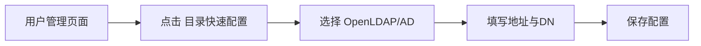
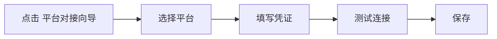

# Go LDAP Admin UI (Dashug Fork)

前端管理界面，配合后端实现目录与第三方平台的可视化配置。

## 致谢

本项目基于 [eryajf/go-ldap-admin-ui](https://github.com/eryajf/go-ldap-admin-ui) 二次开发，感谢原作者与全部贡献者。

## 核心功能

- 用户/分组管理界面
- 目录类型展示（OpenLDAP / AD）
- 目录快速配置入口（地址、DN、类型、同步开关）
- 平台对接向导（钉钉/企微/飞书）
- 测试连接 + 保存配置

## 当前前端对接接口

- `GET /api/base/config`
- `POST /api/base/directoryConfig`
- `POST /api/base/thirdPartyConfig`
- `POST /api/base/thirdPartyConfig/test`

## 页面配置流程

### 目录快速配置

页面入口：`人员管理 -> 用户管理 -> 目录快速配置`

操作步骤：

1. 选择目录类型：`OpenLDAP` / `Windows AD`。
2. 填写地址和 DN 参数。
3. 点击保存。

字段说明（常用）：

- `LDAP地址`：如 `ldap://10.0.0.10:389` 或 `ldaps://ad.example.com:636`
- `Base DN`：如 `dc=example,dc=com`
- `管理员 DN`：用于服务端连接目录
- `用户 OU DN`：新建用户默认写入位置

### 平台对接向导

页面入口：`人员管理 -> 用户管理 -> 平台对接向导`

操作步骤：

1. 选择平台标签页（钉钉 / 企业微信 / 飞书）。
2. 填写平台凭证。
3. 点击 `测试连接`。
4. 成功后点击 `保存`。

建议先完成目录配置，再做平台对接与同步。

## 图文功能说明

### 1. 功能总览图（首页 / 用户管理 / 分组管理）


### 2. 目录快速配置（步骤图 1-2-3）



### 3. 平台对接向导（钉钉 / 企微 / 飞书）



### 4. 测试连接与保存结果示例

```json
{
  "code": 0,
  "msg": "success",
  "data": {
    "platform": "wecom",
    "ok": true
  }
}
```

### 5. 常见错误提示（可选）

- `测试连接失败`：先检查凭证字段是否填错。
- `保存后不同步`：确认对应平台 `启用同步` 是否打开。
- `AD 配置失败`：优先使用 `ldaps://` 地址。

## 维护仓库

- 后端：<https://github.com/dashug/go-ldap-admin>
- 前端：<https://github.com/dashug/go-ldap-admin-ui>
